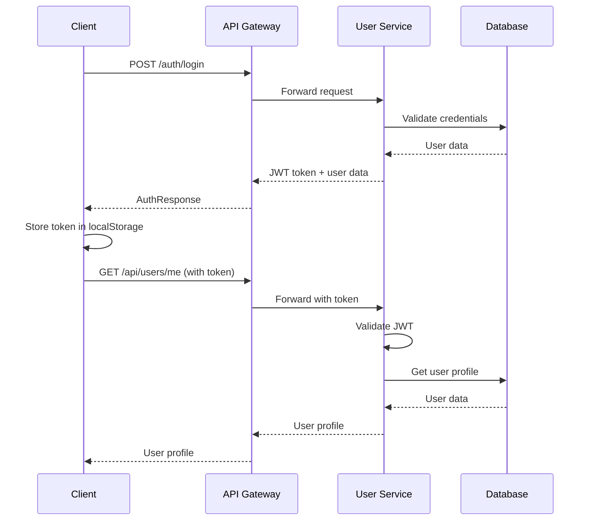

# FlexFit Client-Server Integration Guide

## ✅ Integration Complete

The FlexFit client has been successfully integrated with the backend User Service. Here's what was implemented:

### 🔧 What Was Built

1. **TypeScript Types** - Complete type definitions matching backend DTOs
2. **API Client** - Centralized HTTP client with error handling and token management
3. **Authentication Service** - Login, registration, and token management
4. **User Service** - User profile management and operations
5. **React Auth Context** - Global authentication state management
6. **Updated UI Components** - Real authentication forms with validation

### 📁 New Files Created

```
client/src/
├── types/
│   └── user.ts                 # TypeScript types for API
├── services/
│   ├── apiClient.ts           # Base HTTP client
│   ├── authService.ts         # Authentication service
│   └── userService.ts         # User management service
├── hooks/
│   └── useAuth.tsx            # Authentication context & hook
└── test-integration.js        # Integration test script
```

### 🔄 Updated Files

- `client/app/layout.tsx` - Added AuthProvider wrapper
- `client/app/page.tsx` - Integrated real authentication system

## 🚀 Testing the Integration

### Step 1: Start Backend Services

```bash
# In the project root
docker compose up --build -d

# Verify services are running
docker compose ps
```

Expected services:
- PostgreSQL (port 5432)
- User Service (port 8081)
- API Gateway (port 8000)
- Service Registry (port 8761)

### Step 2: Test Backend Health

```bash
# Test direct access to user service
curl http://localhost:8081/actuator/health

# Test via API Gateway
curl http://localhost:8000/api/users/health
```

### Step 3: Start Client Application

```bash
cd client
npm run dev
```

Client will be available at: http://localhost:3000

### Step 4: Test Authentication Flow

1. **Registration Test**
   - Click "Register" button
   - Fill in user details:
     - Username: `testuser`
     - Email: `test@example.com`
     - Password: `password123`
     - Date of Birth: `1990-01-15`
     - Gender: `Male`
     - Height: `180`
     - Weight: `75`
   - Click "Create Account"
   - Should automatically log in after registration

2. **Login Test**
   - Click "Login" button
   - Enter credentials:
     - Email: `test@example.com`
     - Password: `password123`
   - Click "Sign In"
   - Should redirect to main dashboard

3. **Authentication Persistence Test**
   - After logging in, refresh the page
   - Should remain logged in (token persisted in localStorage)
   - User profile should display in header

4. **Logout Test**
   - Click "Logout" button in header
   - Should redirect to login screen
   - Token should be cleared from localStorage

### Step 5: Verify Integration Points

1. **Token Storage**
   - Open browser DevTools → Application → Local Storage
   - Check for `flexfit_token` key

2. **API Calls**
   - Open browser DevTools → Network tab
   - Monitor API calls to `http://localhost:8000/api/users/...`
   - Verify proper headers (Authorization: Bearer token)

3. **Error Handling**
   - Try logging in with invalid credentials
   - Check for proper error messages
   - Verify error responses are handled gracefully

## 🔍 API Endpoint Mapping

The client connects to these backend endpoints:

| Frontend Action | API Endpoint | Method | Description |
|----------------|--------------|---------|-------------|
| Registration | `/api/users/register` | POST | Create new user |
| Login | `/auth/login` | POST | Authenticate user |
| Get Profile | `/api/users/me` | GET | Get current user |
| Health Check | `/api/users/health` | GET | Service health |

## 🐛 Troubleshooting

### Common Issues

1. **CORS Errors**
   - Backend needs CORS configuration for `http://localhost:3000`

2. **Token Issues**
   - Check if JWT secret is configured in backend
   - Verify token format in localStorage

3. **Network Errors**
   - Ensure backend services are running
   - Check API Gateway routing configuration

4. **Authentication Failures**
   - Verify database connection
   - Check backend logs for errors

### Debug Commands

```bash
# Check backend logs
docker compose logs user-service
docker compose logs api-gateway

# Check database connection
docker exec -it flexfit-postgres psql -U flexfit -d user_service_db -c "SELECT * FROM users;"

# Test API directly
curl -X POST http://localhost:8081/api/v1/users/register \
  -H "Content-Type: application/json" \
  -d '{
    "username": "testuser",
    "email": "test@example.com",
    "password": "password123",
    "dateOfBirth": "1990-01-15",
    "gender": "MALE",
    "heightCm": 180,
    "weightKg": 75.0
  }'
```

## 📊 Integration Features

### ✅ Implemented

- [x] User registration with validation
- [x] User login with JWT tokens
- [x] Token-based authentication
- [x] Automatic token refresh
- [x] User profile display
- [x] Logout functionality
- [x] Error handling and user feedback
- [x] Loading states
- [x] Form validation

### 🔄 Next Steps

- [ ] Password reset functionality
- [ ] Email verification
- [ ] User preferences management
- [ ] Profile picture upload
- [ ] Social authentication
- [ ] Remember me functionality

## 🎯 Success Criteria

The integration is successful if:

1. ✅ User can register a new account
2. ✅ User can log in with valid credentials
3. ✅ Authentication state persists across page refreshes
4. ✅ User profile information displays correctly
5. ✅ User can log out successfully
6. ✅ Error messages display for invalid inputs
7. ✅ API calls include proper authentication headers
8. ✅ Loading states provide good user experience

## 🛠️ Technical Details

### Authentication Flow



### Error Handling

- Network errors → Generic error message
- 401 Unauthorized → Clear token and redirect to login
- 400 Bad Request → Display validation errors
- 500 Server Error → Display server error message

---

🎉 **Integration Complete!** The FlexFit client is now fully connected to the backend User Service with comprehensive authentication and error handling. 