# **FlexFit – System Overview (Submission)**

**1. Initial System Structure**

Describe how you plan to divide the system technically. You must cover: **Server (Spring Boot)**, **Client (React)**, **GenAI Service (Python/LangChain)**, and **Database**.

FlexFit will be developed as a distributed system composed of distinct components communicating over APIs. This modular approach facilitates independent development, deployment, and scaling, following a **Master-Worker** pattern where Spring Boot services orchestrate business logic while specialized workers handle specific tasks.

**Core Architecture Principle:**
- **Master (Spring Boot):** Orchestrates core business logic, user data management, and makes adaptive decisions. Directly calls LLMs for reasoning.
- **Worker (Python/LangChain):** Specialized GenAI tasks, primarily RAG for exercise retrieval.
- **Other Workers (Spring Boot):** Specialized tasks like text-to-speech synthesis.

*   **Server:** The backend logic will be implemented using **Spring Boot (Java)** exposing REST APIs, coordinated via an API Gateway (`api-gateway`). The server-side is decomposed into specialized microservices:
    *   **API Gateway (`api-gateway`):** Spring Cloud Gateway for request routing and JWT validation.
    *   **User Service (`user-service`):** Handles user accounts, comprehensive profiles, preferences, authentication (JWT), and related data persistence.
    *   **Workout Plan Service (`workout-plan-service`):** **Master Orchestrator** - Manages adaptive 7-day plan generation and re-optimization. Calls user-service for preferences, exercise-rag-worker for exercise candidates, and directly calls LLM APIs (GPT-4o or local Phi-3) for adaptive reasoning. Applies safety guardrails and manages plan lifecycle.
    *   **Exercise RAG Worker (`exercise-rag-worker`):** **Python GenAI Worker** - Specialized service for exercise retrieval using RAG against Weaviate vector store.
    *   **TTS Service (`tts-service`):** **Audio Worker** - Synthesizes voice script cue text into audio for workout guidance.
    *   **Metrics Service (`metrics-service`):** Exposes application metrics via Spring Boot Actuator for Prometheus scraping.

*   **Client (`client-web`):** A web-based frontend built using **React** (with Vite, MUI, TanStack Query). Provides a dynamic and responsive user interface for comprehensive user profile setup, sport type selection, viewing adaptive 7-day plans, real-time workout interaction, voice guidance integration, RPE feedback collection, and progress tracking. Communicates exclusively with the API Gateway.

*   **GenAI Service (`exercise-rag-worker`):** A dedicated Python microservice built with **FastAPI** and **LangChain**. Receives exercise retrieval requests with criteria (sport type, muscle group, equipment), performs RAG against Weaviate, and returns candidate exercises with detailed metadata.

*   **Database:**
    *   **PostgreSQL (`postgres`):** Primary relational database storing comprehensive user profiles, preferences, workout plans, daily workouts, scheduled exercises with feedback, and all business data. Managed via JPA/Flyway with detailed schemas.
    *   **Weaviate (`weaviate`):** Vector database storing ~1500 exercises with embeddings, sport types, muscle groups, equipment requirements, and metadata for efficient RAG retrieval.

*   **(Optional) Local LLM Service (`llm-local`):** A container serving a GGUF model (like Phi-3 or Llama) via `llama.cpp`, allowing local LLM inference when configured.

**1.1 Component Table**

This table provides a comprehensive summary of the updated components:

| Layer          | Container            | Main Responsibilities                                        | Technology                                   |
| :------------- | :------------------- | :----------------------------------------------------------- | :------------------------------------------- |
| Presentation   | `client-web`         | Comprehensive UI for profiles, adaptive plans, workout interaction, voice guidance | React + Vite, MUI, TanStack Query            |
| Gateway        | `api-gateway`        | Request routing, JWT validation, single origin               | Spring Cloud Gateway                         |
| Master         | `workout-plan-service` | **Master Orchestrator** - Adaptive planning, LLM reasoning, safety guardrails | Spring Boot 3, LangChain4j                  |
| Micro-services | `user-service`       | User accounts, comprehensive profiles, preferences, auth     | Spring Boot 3, JPA/Flyway                    |
|                | `tts-service`        | **Audio Worker** - Text-to-speech synthesis                 | Spring Boot 3, Java TTS                      |
|                | `metrics-service`    | Application metrics, LLM token counts, latency monitoring   | Spring Boot Actuator                         |
| GenAI Worker   | `exercise-rag-worker` | **Python GenAI Worker** - RAG exercise retrieval from Weaviate | Python, FastAPI, LangChain                  |
| Optional       | `llm-local`          | Local LLM inference (GPU node)                               | CUDA 12 container, llama.cpp                |
| Data           | `postgres`           | User profiles, workout plans, sessions, feedback, business data | PostgreSQL 16                              |
|                | `weaviate`           | Vector store for ~1500 exercises with embeddings            | Weaviate 1.24                               |

**1.2 Use-Case Diagram**

This diagram shows the main ways an end-user interacts with FlexFit—comprehensive profile setup, sport type selection, viewing adaptive 7-day plans, workout execution with voice guidance, RPE feedback, progress tracking, and equipment management.



**1.3 Top-Level Architecture**

This component diagram presents the system's major building blocks—React client, API Gateway, Spring Boot Master-Worker microservices, Python GenAI worker, and data stores—with the REST/monitoring flows between them.



**1.4 Analysis Object Model (UML Class Diagram)**

The class diagram captures FlexFit's comprehensive domain model with detailed enumerations and core entities. The model features extensive enum types for user personalization and a streamlined entity structure optimized for adaptive workout planning.

**Core Domain Entities:**

- **User**: Central entity storing account information, personal data (date_of_birth, height_cm, weight_kg, gender), and authentication details
- **UserPreferences**: Comprehensive user profile storing fitness goals, experience level, sport preferences, available equipment, workout preferences, and health considerations
- **DailyWorkout**: Individual workout session linked directly to a user, containing completion status, RPE feedback, and workout metadata
- **ScheduledExercise**: Exercise instances within daily workouts, containing all exercise details generated by GenAI including descriptions, muscle groups, equipment needs, and voice cues

**Enumeration Types for Personalization:**

The model includes six comprehensive enumerations that drive personalized workout generation:
- **Gender**: Inclusive gender identification (5 values)
- **ExperienceLevel**: Training experience categories (5 levels from TRUE_BEGINNER to REHAB_POSTPARTUM)
- **FitnessGoal**: Multiple fitness objectives (8 goal types)
- **SportType**: Core workout categories (4 types: STRENGTH, HIIT, YOGA_MOBILITY, RUNNING_INTERVALS)
- **EquipmentItem**: Extensive equipment inventory (25+ items from NO_EQUIPMENT to specialized gym equipment)
- **IntensityPreference**: General workout intensity preferences (3 levels)

**Key Relationships:**
- User has one comprehensive UserPreferences profile
- User can have multiple DailyWorkout sessions over time
- Each DailyWorkout includes one or more ScheduledExercise instances
- Enumerations are referenced throughout the model for consistent personalization

**GenAI Integration Points:**
- ScheduledExercise fields (exercise_name, description, muscle_groups, equipment_needed, voice_script_cue_text) are populated by the GenAI system based on user preferences and workout context
- The model supports adaptive planning through RPE feedback collection at both workout and exercise levels



**1.5 Enhanced Data Model & Enums**

**Core Enums for User Personalization:**

```java
// Gender identification (inclusive)
enum Gender {
    MALE, FEMALE, NON_BINARY, PREFER_NOT_TO_SAY, OTHER
}

// Experience-based training adaptation
enum ExperienceLevel {
    TRUE_BEGINNER,      // Never exercised consistently
    BEGINNER,           // <6 months consistent training
    INTERMEDIATE,       // 6-24 months consistent training  
    ADVANCED,           // >24 months consistent training
    REHAB_POSTPARTUM    // Specific cautious progression needs
}

// Multiple fitness goals support
enum FitnessGoal {
    WEIGHT_LOSS, MUSCLE_GAIN, STRENGTH_GAIN, 
    IMPROVE_ENDURANCE, IMPROVE_FLEXIBILITY_MOBILITY,
    GENERAL_HEALTH_FITNESS, ATHLETIC_PERFORMANCE, 
    STRESS_REDUCTION_WELLBEING
}

// Core sport types
enum SportType {
    STRENGTH, HIIT, YOGA_MOBILITY, RUNNING_INTERVALS
}

// Detailed equipment inventory
enum EquipmentItem {
    NO_EQUIPMENT, DUMBBELLS_PAIR_LIGHT, DUMBBELLS_PAIR_MEDIUM,
    DUMBBELLS_PAIR_HEAVY, ADJUSTABLE_DUMBBELLS, KETTLEBELL,
    BARBELL_WITH_PLATES, RESISTANCE_BANDS_LIGHT, RESISTANCE_BANDS_MEDIUM,
    RESISTANCE_BANDS_HEAVY, PULL_UP_BAR, YOGA_MAT, FOAM_ROLLER,
    JUMP_ROPE, BENCH_FLAT, BENCH_ADJUSTABLE, SQUAT_RACK,
    TREADMILL, STATIONARY_BIKE, ELLIPTICAL, ROWING_MACHINE,
    CABLE_MACHINE_FULL, LEG_PRESS_MACHINE, MEDICINE_BALL, STABILITY_BALL
    // ... (extensible list)
}

// Workout timing preferences
enum TimeOfDay {
    MORNING, MIDDAY, AFTERNOON, EVENING, ANY_TIME
}

// General intensity preferences
enum IntensityPreference {
    LOW_MODERATE, MODERATE_HIGH, PUSH_TO_LIMIT
}

// Session-specific energy levels
enum SessionEnergyLevel {
    VERY_LOW, LOW, MODERATE, HIGH, VERY_HIGH
}
```

**Enhanced Database Schema (PostgreSQL):**

**User Service Tables:**
- `users`: Core account and personal data (id, username, email, password_hash, date_of_birth, height_cm, weight_kg, gender, timestamps)
- `user_preferences`: Comprehensive profile (user_id, experience_level, fitness_goals[], preferred_sport_types[], available_equipment[], workout_duration_range, intensity_preference, health_notes, disliked_exercises[])

**Workout Plan Service Tables:**
- `daily_workouts`: Individual workout sessions (id, user_id, day_date, focus_sport_type_for_the_day, completion_status, rpe_overall_feedback, cadence_metrics, completion_notes)
- `scheduled_exercises`: Exercise instances with GenAI-generated content (id, daily_workout_id, sequence_order, exercise_name, description, applicable_sport_types[], muscle_groups_primary[], muscle_groups_secondary[], equipment_needed[], difficulty, prescribed_sets_reps_duration, voice_script_cue_text, video_url, rpe_feedback, completion_status)

**Weaviate Schema:**
- `Exercises Collection`: Reference exercise database for GenAI retrieval (exercise_id, name, description, vector_embedding, sport_types[], muscle_groups_primary[], muscle_groups_secondary[], equipment_needed[], difficulty, video_url, default_cues[])

**2. First Product Backlog**

Prepare a simple backlog in a Markdown table or GitHub Project. Each item should be a feature or task. This backlog covers foundational setup and initial functionality, roughly corresponding to Sprint 0/1.

| ID  | Item Type | Description                                                     | Priority | Estimate | Status      |
| :-- | :-------- | :-------------------------------------------------------------- | :------- | :------- | :---------- |
| F01 | Feature   | User can create comprehensive profile with preferences          | High     | L        | To Do       |
| F02 | Feature   | User can select sport types and equipment inventory             | High     | M        | To Do       |
| T01 | Task      | Setup React project with enhanced profile forms (`client-web`) | High     | M        | To Do       |
| T02 | Task      | Setup Spring Boot parent POM & microservices structure         | High     | M        | To Do       |
| T03 | Task      | Implement `api-gateway` with Spring Cloud Gateway              | High     | M        | To Do       |
| T04 | Task      | Implement `user-service` with enhanced profile schema          | High     | L        | To Do       |
| T05 | Task      | Implement `workout-plan-service` as Master Orchestrator        | High     | XL       | To Do       |
| T06 | Task      | Implement `exercise-rag-worker` Python service                 | High     | L        | To Do       |
| T07 | Task      | Implement `tts-service` for voice guidance                     | Medium   | M        | To Do       |
| T08 | Task      | Setup PostgreSQL with comprehensive schema via Flyway          | High     | L        | To Do       |
| T09 | Task      | Setup Weaviate with exercise embeddings                        | High     | M        | To Do       |
| F03 | Feature   | Display adaptive 7-day workout plan                            | High     | L        | To Do       |
| F04 | Feature   | Real-time workout execution with voice guidance                 | High     | L        | To Do       |
| F05 | Feature   | RPE feedback collection and plan adaptation                     | High     | M        | To Do       |
| T10 | Task      | Implement LLM integration in `workout-plan-service`            | High     | L        | To Do       |
| T11 | Task      | Connect services via API Gateway routing                       | High     | M        | To Do       |
| T12 | Task      | Implement safety guardrails and validation logic               | High     | M        | To Do       |
| T13 | Task      | Create comprehensive enum definitions across services           | Medium   | M        | To Do       |
| T14 | Task      | Load initial ~1500 exercises into Weaviate                     | Medium   | M        | To Do       |
| T15 | Task      | Containerize all microservices                                  | High     | L        | To Do       |
| T16 | Task      | Create docker-compose.yml for full system                      | High     | L        | To Do       |
| T17 | Task      | Implement JWT authentication flow                               | High     | L        | To Do       |
| T18 | Task      | Setup metrics collection and Prometheus integration            | Medium   | M        | To Do       |
| T19 | Task      | Implement client-server communication with TanStack Query      | High     | M        | To Do       |
| T20 | Task      | Create user onboarding flow with profile setup                 | Medium   | M        | To Do       |
| F06 | Feature   | Progress tracking and workout history visualization             | Medium   | L        | To Do       |
| T21 | Task      | Setup GitHub Actions CI/CD pipeline                            | High     | M        | To Do       |
| T22 | Task      | Implement error handling and logging across services           | Medium   | M        | To Do       |
| T23 | Task      | Create API documentation and service contracts                  | Medium   | M        | To Do       |
| T24 | Task      | Performance testing and optimization                            | Low      | L        | To Do       |
| T25 | Task      | Setup monitoring and alerting infrastructure                    | Medium   | M        | To Do       |

*(Priorities: High, Medium, Low. Estimates: S, M, L, XL - relative sizing based on complexity and scope)*

---
<div style="display: flex; align-items: center; border: 1px solid #ccc; padding: 10px; border-radius: 5px; background-color: #f9f9f9; margin-top: 20px;">
    <span style="font-size: 24px; margin-right: 10px; font-family: 'Apple Color Emoji', 'Segoe UI Emoji', 'Segoe UI Symbol';">📅</span>
    <div>
        <strong style="font-size: 1.1em;">Important Notes</strong>
        <ul style="margin: 5px 0 0 20px; padding: 0;">
            <li>This document must be stored in your team's GitHub repository.</li>
        </ul>
    </div>
</div>

---