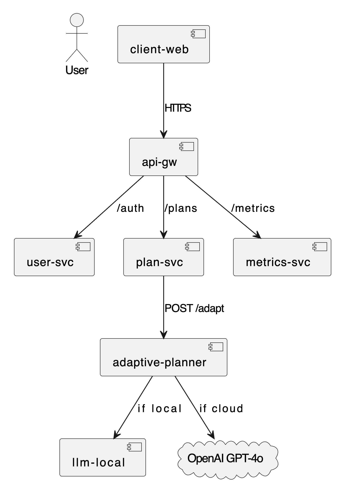
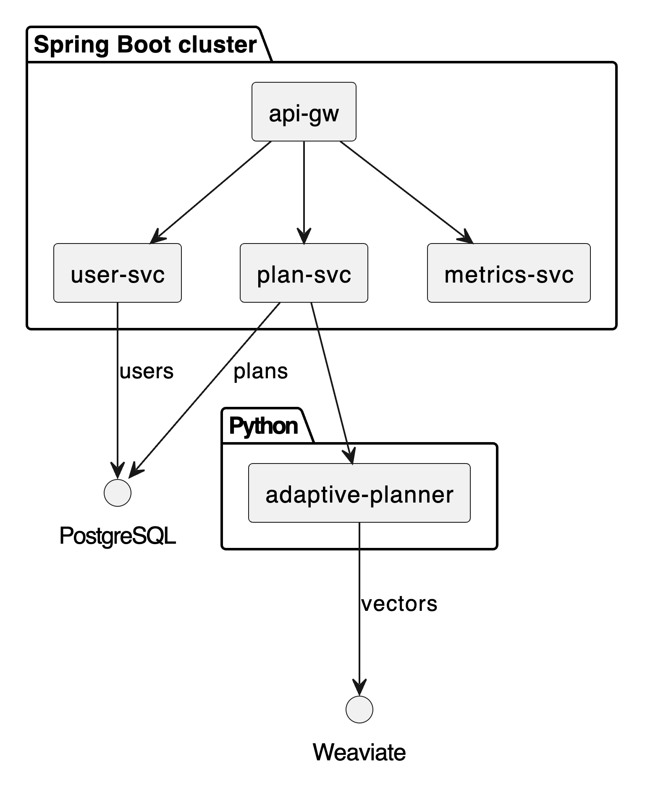

**FlexFit – System Overview (Submission)**

**1. Initial System Structure**

Describe how you plan to divide the system technically. You must cover: **Server (Spring Boot)**, **Client (React)**, **GenAI Service (Python/LangChain)**, and **Database**.

FlexFit will be developed as a distributed system composed of distinct components communicating over APIs. This modular approach facilitates independent development, deployment, and scaling.

*   **Server:** The backend logic will be implemented using **Spring Boot (Java)** exposing REST APIs, likely coordinated via an API Gateway (`api-gw`). To meet the requirement of multiple microservices, the server-side will be decomposed into:
    *   **User Service (`user-svc`):** Handles user profiles, preferences (sport type, equipment), authentication (JWT), and related data persistence.
    *   **Workout Plan Service (`plan-svc`):** Manages the creation, storage, retrieval, and high-level modification of the 7-day workout plans. It coordinates calls to the GenAI service for adaptive adjustments.
    *   **Session Service (Potentially part of `plan-svc` initially or separate):** Records completed workout sessions, including exercises performed, user feedback (RPE), and tracked metrics. Triggers plan updates via the Workout Plan Service.
    *   **Metrics Service (`metrics-svc`):** Exposes application metrics (e.g., via Spring Boot Actuator) for Prometheus scraping.
*   **Client (`client-web`):** A web-based frontend built using **React** (with Vite, MUI, TanStack Query). This provides a dynamic and responsive user interface for selecting sport types, viewing the daily workout, interacting during the session (including triggering voice cues via the browser's Web Speech API), providing feedback (RPE input), and viewing progress. It will communicate exclusively with the API Gateway.
*   **GenAI Service (`adaptive-planner`):** A dedicated microservice built with **Python** using **FastAPI** and **LangChain**. This service encapsulates all AI-driven logic: receives context from the `plan-svc`, performs RAG lookups against Weaviate, uses an LLM (cloud or local via `llm-local`) for adaptive reasoning, applies safety guardrails, and returns updated plan details.
*   **Database:**
    *   **PostgreSQL (`postgres`):** A relational database used by the Spring Boot services (`user-svc`, `plan-svc`) to store user data, workout plans, session history, RPE scores, and progress metrics. Managed via JPA/Flyway.
    *   **Weaviate (`weaviate`):** A vector database used by the `adaptive-planner` service, storing exercise descriptions, embeddings, and metadata (~1500 exercises) for efficient RAG retrieval.
*   **(Optional) Local LLM Service (`llm-local`):** A container serving a GGUF model (like Phi-3 or Llama) via an interface like `llama.cpp`, allowing local LLM inference if configured, potentially requiring GPU resources.

**1.1 Component Table**

This table provides a concise summary of the components:

| Layer          | Container        | Main Responsibilities                                        | Technology                                   |
| :------------- | :--------------- | :----------------------------------------------------------- | :------------------------------------------- |
| Presentation   | `client-web`     | Render adaptive 7-day plan, capture RPE, play TTS cues       | React + Vite, MUI, TanStack Query            |
| Gateway        | `api-gw`         | Single origin, JWT validation, route to services             | Spring Boot 3, Spring Cloud Gateway          |
| Micro-services | `user-svc`       | Auth, user profile & equipment                               | Spring Boot 3, JPA/Flyway                    |
|                | `plan-svc`       | Create/adjust plans, call GenAI                              | Spring Boot 3                                |
|                | `metrics-svc`    | `/actuator/prometheus` endpoint                              | Spring Boot Actuator                         |
| GenAI          | `adaptive-planner` | RAG over Weaviate, GPT-4o / local Llama reasoning, safety guardrails | FastAPI + LangChain                         |
| Optional       | `llm-local`      | Serve GGUF model via llama.cpp (GPU node)                    | CUDA 12 container                            |
| Data           | `postgres`       | Relational storage for users & plans                         | PostgreSQL 16                              |
|                | `weaviate`       | Vector store for ~1 500 exercises                            | Weaviate 1.24                              |

**1.2 Top-Level Architecture (PlantUML)**

This diagram shows the high-level components and their primary interactions.

**1.3 Subsystem Decomposition (PlantUML)**

This diagram details the interactions within the backend clusters and data layers.

**2. First Product Backlog**

Prepare a simple backlog in a Markdown table or GitHub Project. Each item should be a feature or task. This backlog covers foundational setup and initial functionality, roughly corresponding to Sprint 0/1.

| ID  | Item Type | Description                                                     | Priority | Estimate | Status      |
| :-- | :-------- | :-------------------------------------------------------------- | :------- | :------- | :---------- |
| F01 | Feature   | User can select one Sport Type (Strength, HIIT, etc.)           | High     | S        | To Do       |
| T01 | Task      | Setup basic React project structure (`client-web`, Vite+MUI)    | High     | S        | To Do       |
| T02 | Task      | Setup basic Spring Boot parent POM & mono-repo structure        | High     | M        | To Do       |
| T03 | Task      | Implement `api-gw` skeleton (Spring Cloud Gateway)              | High     | M        | To Do       |
| T04 | Task      | Implement basic `user-svc` (store selected sport type, CRUD)    | High     | M        | To Do       |
| T05 | Task      | Implement basic `plan-svc` (generate static Day 0 plan)         | High     | L        | To Do       |
| T06 | Task      | Implement `metrics-svc` (Actuator endpoint exposure)            | Medium   | S        | To Do       |
| T07 | Task      | Setup PostgreSQL database schema (Users, Plans via Flyway)      | High     | M        | To Do       |
| T08 | Task      | Setup basic Python/FastAPI/LangChain project (`adaptive-planner`)| High     | M        | To Do       |
| F02 | Feature   | Display the first day's workout exercises on the client         | High     | M        | To Do       |
| T09 | Task      | Implement basic Client UI for showing workout list              | High     | M        | To Do       |
| T10 | Task      | Connect Client to Server (`api-gw` -> `plan-svc`) to fetch plan | High     | M        | To Do       |
| F03 | Feature   | Basic voice guidance for one exercise name (using Web Speech API)| Medium   | M        | To Do       |
| T11 | Task      | Implement client-side TTS trigger                             | Medium   | S        | To Do       |
| F04 | Feature   | User can provide RPE feedback (1-10) after a session/set        | Medium   | M        | To Do       |
| T12 | Task      | Implement RPE input UI on the client                          | Medium   | S        | To Do       |
| T13 | Task      | Send RPE feedback from Client to `plan-svc` (or Session Svc)    | Medium   | M        | To Do       |
| T14 | Task      | Store RPE feedback in `plan-svc`/PostgreSQL                   | Medium   | M        | To Do       |
| T15 | Task      | Containerize `client-web` (Dockerfile)                          | High     | S        | To Do       |
| T16 | Task      | Containerize Spring Boot Services (`api-gw`, `user-svc`, etc.)  | High     | M        | To Do       |
| T17 | Task      | Containerize `adaptive-planner` (Dockerfile)                    | High     | M        | To Do       |
| T18 | Task      | Create `docker-compose.yml` for local end-to-end setup          | High     | L        | To Do       |
| T19 | Task      | Setup Weaviate instance (`weaviate`, via Docker Compose)        | Medium   | M        | To Do       |
| T20 | Task      | Script to load initial exercise CSV data into Weaviate          | Medium   | M        | To Do       |
| T21 | Task      | Basic `adaptive-planner` endpoint PoC (takes context, returns dummy) | Medium | L        | To Do       |
| T22 | Task      | Connect `plan-svc` to call `adaptive-planner` service           | Medium   | M        | To Do       |
| T23 | Task      | Setup basic GitHub Actions workflow (lint, build, basic tests)  | High     | M        | To Do       |
| T24 | Task      | Implement basic JWT Auth flow (`client` -> `api-gw` -> `user-svc`)| High   | L        | To Do       |
| T25 | Task      | Configure Prometheus scraping via `docker-compose`              | Medium   | S        | To Do       |

*(Priorities: High, Medium, Low. Estimates: S, M, L - relative sizing based loosely on effort/complexity)*

---

    📅
    

        <strong style="font-size: 1.1em;">Important Notes</strong>
        <ul style="margin: 5px 0 0 20px; padding: 0;">
            <li>This document must be stored in your team's GitHub repository.</li>
        </ul>
    

---